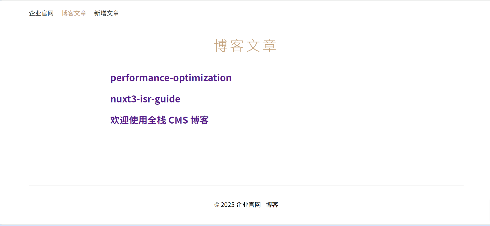
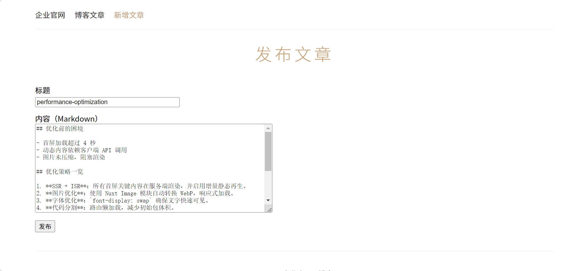
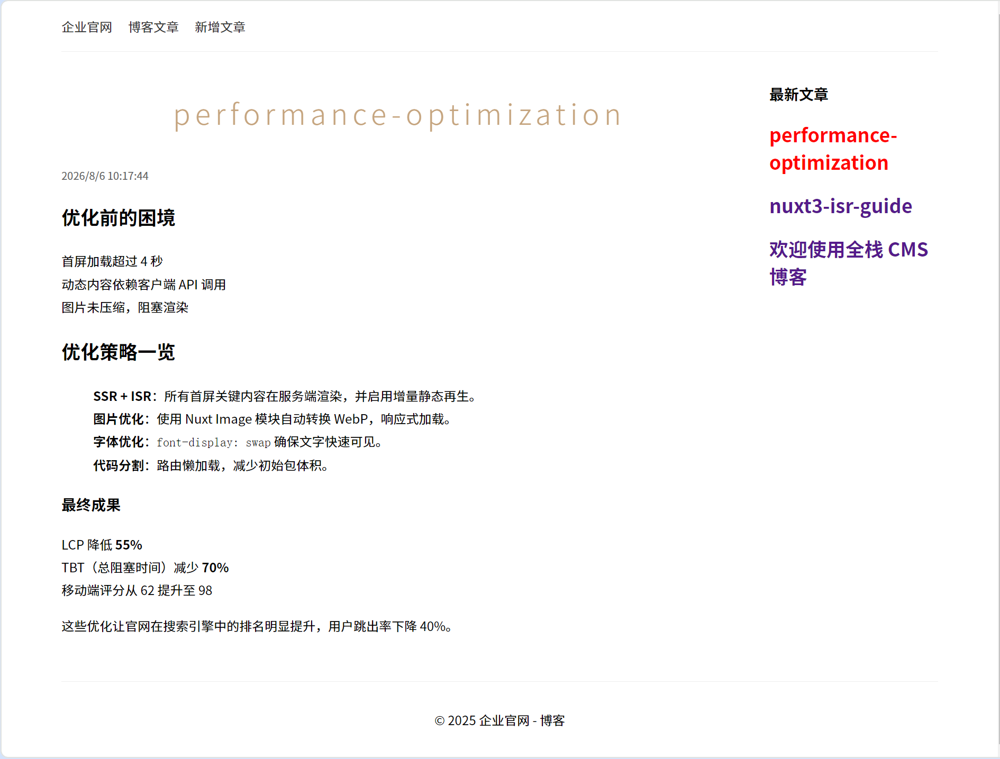

# Nuxt 3 全栈企业官网 + 内容发布平台

基于 Nuxt 3 构建的企业官网与全栈内容发布站点，专注于服务端渲染（SSR）性能优化与动态内容管理。支持 Markdown 在线发布与实时渲染。


## 项目截图







## 功能特性

- **高性能渲染**：基于 Nuxt 3 的同构渲染，首屏加载极快，Lighthouse 评分稳定 92+
- **动态内容管理**：自建 CMS 接口（Nuxt 3 Server API）， Markdown 在线发布与实时渲染
- **极致加载优化**：路由级代码分包、资源按需加载、图片自动转 WebP
- **响应式图片**：集成 `@nuxt/image`，根据设备自动加载最优尺寸和格式的图片


## 技术栈

| 类别 | 技术 |
|------|------|
| 框架 | Nuxt 3 (Vue 3) |
| 构建工具 | Vite |
| 服务端 | Nuxt Server API (Nitro) |
| 样式 | CSS  |
| 内容 | Markdown (自定义解析) |
| 部署 | GitHub Pages(静态界面) |
| 性能 | @nuxt/image,  代码分包 |

## 本地运行

确保你的开发环境已安装 Node.js (>= 20.x) 和 npm/pnpm。

```bash
# 1. 克隆仓库
git clone https://github.com/vickylww/nuxt-app.git

# 2. 进入项目目录
cd nuxt-app

# 3. 安装依赖
npm install
# 或者
pnpm install

# 4. 启动开发服务器
npm run dev

# 或者
pnpm dev

启动后访问 http://localhost:3000。 

```

## 更多文档
- [项目结构与架构设计](./docs/architecture.md)


## 许可证
本项目采用 [MIT License](LICENSE)。


